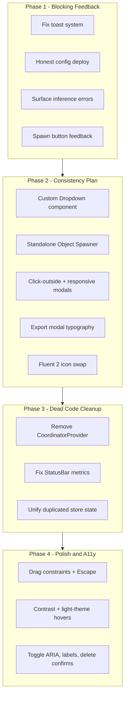

# SYNTHIA UI Fixes Plan

Both `[project_info__88.md](project_info__88.md)` (39-finding audit) and `[project_info__89.md](project_info__89.md)` (dropdown/modal/icon plan) are confirmed against the current codebase. This plan merges them into four phases, ordered by user impact.

---

## Phase 1 — Blocking feedback (unblocks ~40 call sites)

### 1.1 Fix the toast system (F1)

**Problem is worse than the audit states.** `[src/components/ui/Toast.tsx](src/components/ui/Toast.tsx)` has `visibleToasts={0}` *and* `synthiaToast` never calls Sonner — it only writes to console + `[useLogStore](src/store/logStore.ts)`.

**Changes:**

- Set `visibleToasts={4}` on `<Toaster>`
- Import `toast` from `sonner` and call it from each `synthiaToast.*` method (keep log-store writes as secondary channel)
- Style toasts with existing `toastOptions` (already themed)
- Respect light/dark theme: read `document.documentElement.classList.contains('light')` or pass theme from store

### 1.2 Honest "Deploy Cognition Config" (F10)

In `[src/components/agent/AgentSettingsModal.tsx](src/components/agent/AgentSettingsModal.tsx)` `handleConnect()`:

- Rename button to **"Save Config"** and show success only after persisting to store
- OR (preferred): call existing `client.testConnection()` before showing success — reuse the same path as `handleTestConnection`
- Remove the fake `setTimeout(600)` success path

### 1.3 Surface AgentLoop inference failures (F38)

In `[src/world/agent/AgentLoop.ts](src/world/agent/AgentLoop.ts)` `cycle()` catch block:

- Call `runtimeStore.setLoopState(agentId, 'error')` instead of always resetting to `'idle'` in `finally`
- Call `synthiaToast.error(...)` with a short HTTP/status message
- `[AgentStatus.tsx](src/components/agent/AgentStatus.tsx)` already maps `'error'` — verify it renders visibly

### 1.4 Spawn Agent in-flight feedback (F11)

In `[src/App.tsx](src/App.tsx)` "+ Spawn Agent" button + `[src/world/hooks/useWorld.ts](src/world/hooks/useWorld.ts)`:

- Add `spawning: boolean` to `[uiStore](src/store/uiStore.ts)`
- Disable button + show spinner while `spawnAgent()` runs
- Toast success on non-null return, toast error on failure/null

---

## Phase 2 — Consistency plan from project_info__89

### 2.1 New `Dropdown` component (§1)

Create `[src/components/ui/Dropdown.tsx](src/components/ui/Dropdown.tsx)`:

- Trigger styled like current selects (`h-8`, `bg-bg-elevated`, `rounded-btn`)
- Menu: `max-h-[280px] overflow-y-auto`, `rounded-btn`, `z-[130]`, glass styling
- Keyboard: ArrowUp/Down, Enter, Escape; click-outside closes
- `mousedown`/`click` stops propagation (required so modal backdrop-click doesn't fire)
- Props: `value`, `onChange`, `items: {value, label}[]`, optional `searchable`

**Replace 4 native `<select>` sites:**

| File                                                                          | Select                |
| ----------------------------------------------------------------------------- | --------------------- |
| `[src/App.tsx](src/App.tsx)` ~L97                                             | Agent selector        |
| `[AgentSettingsModal.tsx](src/components/agent/AgentSettingsModal.tsx)` ~L344 | Provider (24 options) |
| same ~L365                                                                    | Model                 |
| same ~L734                                                                    | Voice (`searchable`)  |

### 2.2 Object Spawner — standalone draggable panel (§2)

**A.** Remove spawn footer button from `[GodModePanel.tsx](src/components/godmode/GodModePanel.tsx)` (pinned bottom "Spawn OBJECTS" button)

**B.** Add dedicated trigger in `[App.tsx](src/App.tsx)` at `top-[164px] left-4` (matches gear/export button pattern)

**C.** Rebuild `[ObjectSpawner.tsx](src/components/godmode/ObjectSpawner.tsx)`:

- Remove `fixed inset-0 bg-black/60 backdrop-blur-sm` overlay wrapper
- Use GodMode-style `motion.div` draggable floating panel at `z-[60]`, default position `right-[8vw] top-[18vh]` so world stays visible during spawn
- Add `dragConstraints` (Phase 4) to prevent off-screen loss
- Fix F12: keep `pendingModel` until spawn confirms — dispatch `synthia:spawnCustomComplete` from `useWorld` on success; clear state only then

### 2.3 Click-outside-to-close modals (§3)

Add backdrop `onClick={() => close()}` + inner panel `onClick={(e) => e.stopPropagation()}`:

- `[ExportModal.tsx](src/components/export/ExportModal.tsx)`
- `[AgentSettingsModal.tsx](src/components/agent/AgentSettingsModal.tsx)`

Also add Escape handler to AgentSettingsModal (missing today — F20 partial fix).

### 2.4 Export modal typography (§4)

In `[ExportModal.tsx](src/components/export/ExportModal.tsx)`, raise micro-typography floor:

- Preview column: `w-[280px]` → `w-[300px]`
- All `text-[8px]`/`text-[9px]` → `text-[10px]`/`text-[11px]` with slightly more padding/spacing
- Left panel: `space-y-5` → `space-y-6`; session rows `py-2`
- Fix F24: wire session checkbox `onChange` properly (label-wrapped row)

### 2.5 Fluent 2 icon migration (§5)

- Add `@fluentui/react-icons` to `[package.json](package.json)`
- Create `[src/components/ui/icons.ts](src/components/ui/icons.ts)` — central re-exports + `PRESET_ICONS` registry for ObjectSpawner dynamic lookup
- Swap **14 files** currently importing `@phosphor-icons/react` (see grep results)
- Update `[src/constants/objectPresets.ts](src/constants/objectPresets.ts)` icon keys to use `PRESET_ICONS[preset.icon]`
- Remove `@phosphor-icons/react` after build passes

### 2.6 Responsive modals (F26 — bundled with modal work)

Add to ExportModal, AgentSettingsModal, ObjectSpawner shells:

- `max-w-[calc(100vw-2rem)] max-h-[calc(100vh-2rem)]`
- Fixed widths become `w-[840px]` etc. as preferred size, not hard cap

---

## Phase 3 — Dead coordinator-era cleanup

### 3.1 Remove CoordinatorProvider (F3)

- Remove `<CoordinatorProvider>` wrapper from `[src/main.tsx](src/main.tsx)`
- Delete `[src/world/contexts/CoordinatorContext.tsx](src/world/contexts/CoordinatorContext.tsx)` (and any unused `coordinatorContextCore.ts` exports)
- Prune orphaned i18n strings in `[src/constants/strings.ts](src/constants/strings.ts)` (F4): `STATUS.*`, `TOASTS.CONNECT_SUCCESS`, dead GodMode strings, fake export preview strings

### 3.2 Fix StatusBar (F2, F34)

In `[src/components/layout/StatusBar.tsx](src/components/layout/StatusBar.tsx)`:

- **Remove** stale cells: RTT, Inference, FPS, Heartbeat (never populated in client mode)
- **Keep** Frame size + Cycle ms (wire cycle from `agentRuntimeStore` instead of stale `connectionStore.cycleMs`)
- Remove hardcoded green "Active" dot — replace with simple "Client" label or agent loop state from `agentRuntimeStore`
- Optionally delete unused fields from `[connectionStore.ts](src/store/connectionStore.ts)`

### 3.3 Unify duplicated store state (F7, F8, F33)

In `[worldStore.ts](src/store/worldStore.ts)`:

- Remove `useMultiBodyPD`, `bodyMode`, `useProcedural`, `useMuJoCo` and their setters/session slots
- Update `[useWorld.ts](src/world/hooks/useWorld.ts)` `spawnAgent()` to read `agentStore` for multi-body PD
- Verify no remaining readers via grep before deleting

### 3.4 Fix rehydration modal (F5)

In `[useWorld.ts](src/world/hooks/useWorld.ts)` `init()`: do **not** call `setHasRehydrated(true)` unconditionally — let `AgentLoop.start()` own that transition so `[RehydrationModal.tsx](src/components/ui/RehydrationModal.tsx)` can display.

---

## Phase 4 — Accessibility, theme, and polish

### 4.1 Panel drag safety + keyboard (F25, F20, F21)

Shared hook: `src/hooks/useModalAccessibility.ts` — Escape-to-close, focus trap, focus restore on close.

Apply to: AgentSettingsModal, ExportModal, GodModePanel, App right panel.

Add `dragConstraints={{ top: 0, left: 0, right: 0, bottom: 0 }}` with Framer Motion constraint ref sized to keep ~10% of panel on-screen for GodModePanel, right panel, ObjectSpawner, ModelInputPiP.

Keep trigger buttons visible while panels are open (or ensure Escape works).

### 4.2 Theme fixes (F22, F23, F28)

`[globals.css](src/styles/globals.css)`:

- Dark `--text-tertiary`: `#555555` → `#9ca3af`
- Light `--text-tertiary`: `#888888` → `#6b7280`

Replace `hover:bg-white/10` / `bg-white/10` active states across `[App.tsx](src/App.tsx)`, GodModePanel, modals with theme-aware tokens (`bg-bg-hover`) or `dark:bg-white/10 light:bg-black/5`.

Replace hardcoded colors: App option `bg-[#111115]`, StructureViewer red classes, ModelInputPiP green classes → design tokens.

### 4.3 Toggle consolidation + ARIA (F9, F19)

Enhance `[Toggle.tsx](src/components/ui/Toggle.tsx)`: add `role="switch"`, `aria-checked={enabled}`, optional `aria-label`.

Replace inline switches in BodyControls, PhysicsControls, AgentBodyControls.

Add "Debug Joints" toggle to BodyControls (F35).

### 4.4 Icon button labels (F18)

Add `aria-label` to all icon-only buttons: App panel triggers, modal close X buttons, LogViewer trash, spawner trigger.

### 4.5 Destructive action confirms (F14, F15, F16)

- Global Delete/Backspace in `useWorld.ts`: `window.confirm` before `synthia:deleteObject`
- StructureViewer "Delete Object" button: same confirm
- LogViewer clear: lightweight confirm

### 4.6 Remaining real-problem polish

| Finding | Fix                                                                       |
| ------- | ------------------------------------------------------------------------- |
| F17     | Remove no-op "Set Goal" button; Clear Goal should not flip directive mode |
| F32     | AgentStatus: show `activeAgentId` instead of hardcoded `SYNTHIA-01`       |
| F31     | MemoryViewer: label "Last 10 of N"                                        |
| F37     | WorldViewport piano rewards: project world position to screen coords      |
| F36     | `index.html` title → `SYNTHIA`                                            |
| F27     | Raise ModelInputPiP to `z-40`                                             |

**Deferred (lower ROI, can follow up):**

- F30 (per-agent vs global vision settings) — needs product decision on whether vision is world-level or per-agent
- F6 (injection queue badge) — remove badge or wire client-side queue
- F39 (model dropdown desync) — minor edge case

---

## Verification checklist

1. `npm run typecheck && npm run build` — zero `@phosphor-icons/react` imports
2. Trigger spawn, export, injection, inference error — visible toasts appear bottom-right
3. Open God Mode + Object Spawner separately — no stacked blur overlays; world visible during spawn
4. Export/Settings modals: backdrop click closes; dropdown inside modal does not
5. Provider dropdown: rounded menu, scrolls at 280px max
6. Drag panels to screen edge — panel stays recoverable; Escape closes modals
7. Light theme: hover states visible on top-center pill and GodMode controls
8. Delete key on selected object — confirm dialog appears

---

## Key files (by phase)

| Phase | Primary files                                                                                                                                         |
| ----- | ----------------------------------------------------------------------------------------------------------------------------------------------------- |
| 1     | `Toast.tsx`, `AgentSettingsModal.tsx`, `AgentLoop.ts`, `App.tsx`, `uiStore.ts`, `useWorld.ts`                                                         |
| 2     | **NEW** `Dropdown.tsx`, **NEW** `icons.ts`, `ObjectSpawner.tsx`, `GodModePanel.tsx`, `ExportModal.tsx`, `App.tsx`, `objectPresets.ts`, `package.json` |
| 3     | `main.tsx`, `StatusBar.tsx`, `worldStore.ts`, `useWorld.ts`, `strings.ts`                                                                             |
| 4     | **NEW** `useModalAccessibility.ts`, `globals.css`, `Toggle.tsx`, `BodyControls.tsx`, `WorldViewport.tsx`, `index.html`                                |

